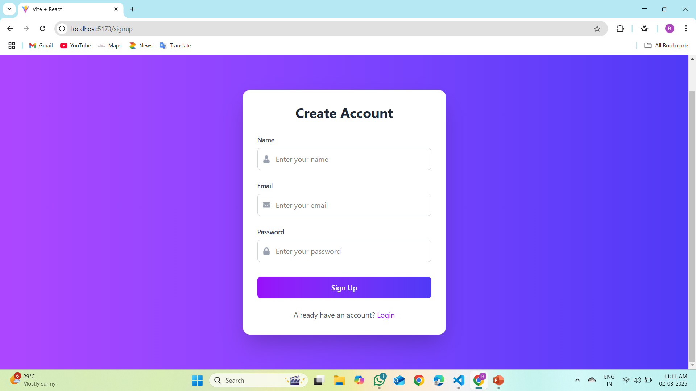
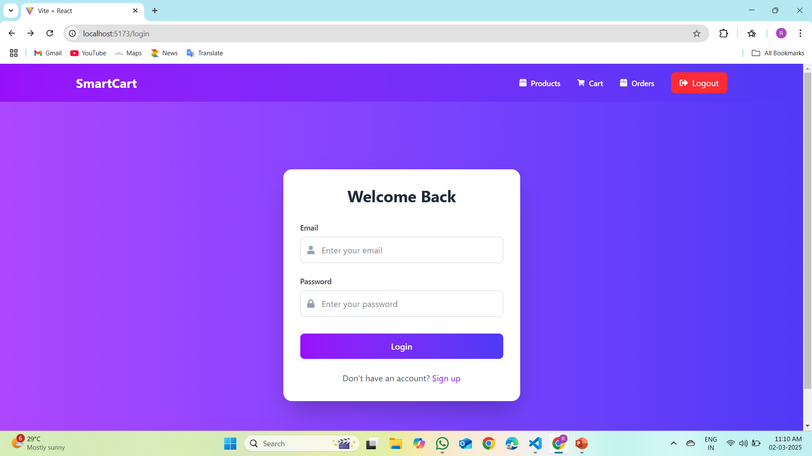
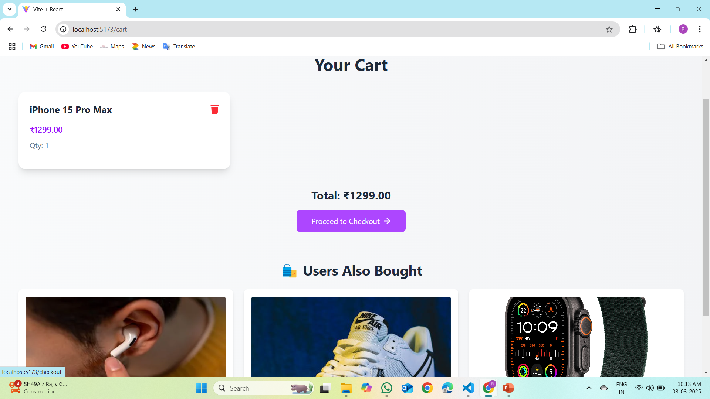
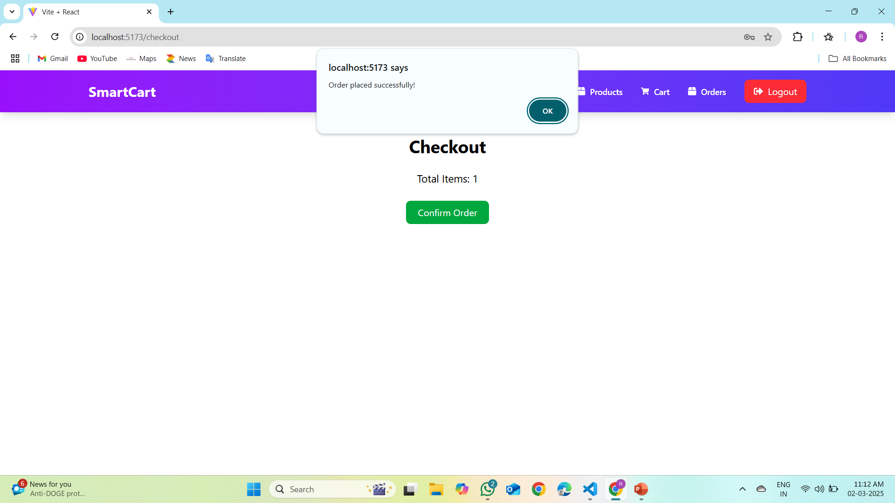
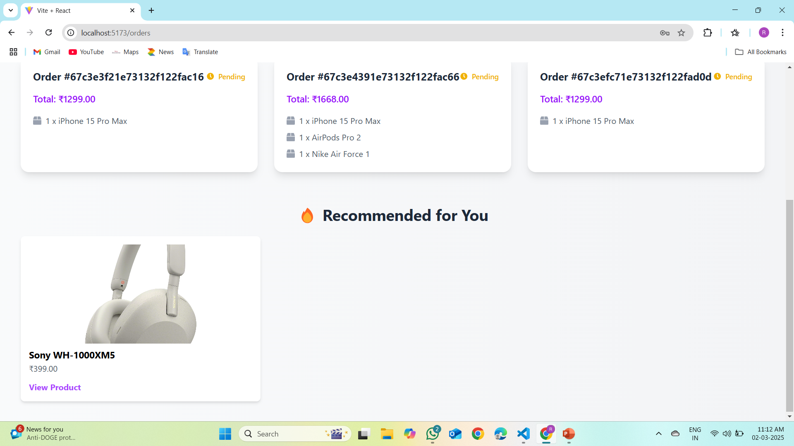
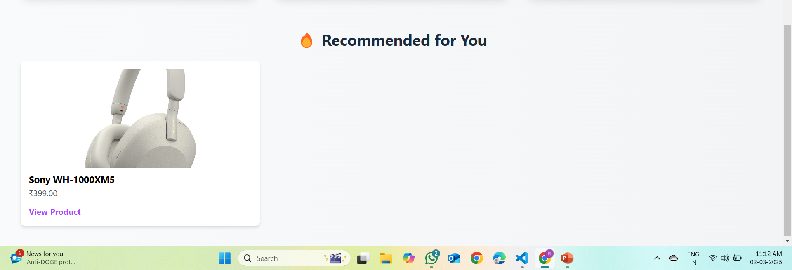

# 🛒 E-Commerce Platform with Personalized Recommendations and Dynamic Pricing

An advanced e-commerce platform that integrates **AI-powered product recommendations** and **dynamic pricing** to improve user experience and increase revenue.

---

## 🚀 Key Features

### 🔹 Personalized Recommendations
- Collaborative & content-based filtering  
- Uses user browsing history, purchases & behavior  
- Shows relevant product suggestions  

### 🔹 Dynamic Pricing
- Adjusts prices in real time  
- Based on demand, stock, competitor pricing & trends  

### 🔹 User Management
- Signup, login & secure authentication  
- Personalized dashboard  

### 🔹 Analytics & Insights
- Monthly order distribution  
- Customer spending analysis  
- Orders per customer  

---

## 🧠 Architecture Diagram


---

## 📸 User Interface Screens

### 🔹 Sign Up


### 🔹 Login


### 🔹 Product Listing


### 🔹 Product Details


### 🔹 Cart


### 🔹 Checkout


### 🔹 Orders


### 🔹 Recommendations


---

## 📁 Folder Structure (Simple)

```

📦 Project
├── frontend/      # UI (HTML, CSS, JS, Bootstrap)
├── backend/       # API, Routing, Business Logic
├── ml/            # Recommendation + Pricing models
└── README.md

````

---

## ⚙️ Installation

### 1️⃣ Clone
```bash
git clone https://github.com/MarriRajasekhar/Ecommerce-Platform-With-Recommendations.git
cd Ecommerce-Platform-With-Recommendations
````

### 2️⃣ Backend Setup (Node.js)

```bash
cd backend
npm install
npm start
```

➡ Runs at: **[http://localhost:5000](http://localhost:5000)**

### 3️⃣ ML Service (Python)

```bash
cd ml
pip install -r requirements.txt
python api.py
```

➡ ML API runs at: **[http://localhost:5001](http://localhost:5001)**

### 4️⃣ Frontend

Open directly:

```
frontend/index.html
```

OR using Vite:

```bash
cd frontend
npm install
npm run dev
```

➡ Frontend runs at: **[http://localhost:5173](http://localhost:5173)**

---

## 🔌 Important API Endpoints

### ⭐ Recommendations

```
POST http://localhost:5001/recommend
{
  "user_id": 1
}
```

### ⭐ Dynamic Pricing

```
POST http://localhost:5001/price
{
  "product_id": 21,
  "demand": 80,
  "stock": 40
}
```

---

## 👨‍💻 Developed By

**Marri Rajasekhar,**
**Muthyala Veera Hemanth,**
Guided by **Dr. G. Sabeena Gnanaselvi**

Just tell me!
```
